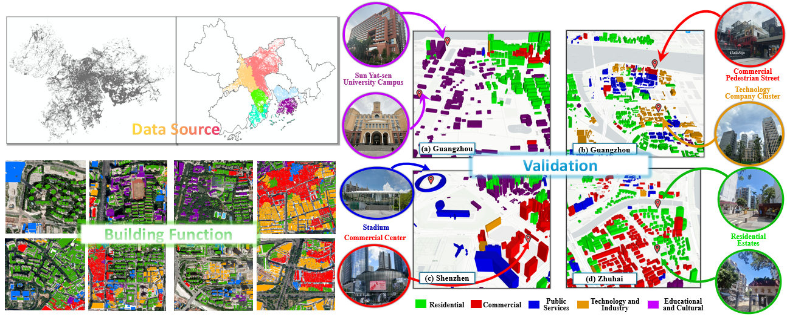
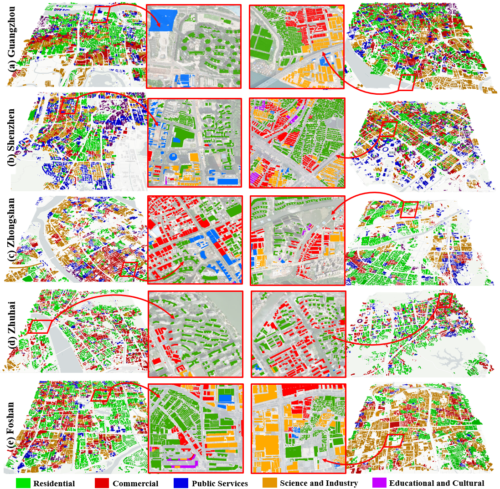
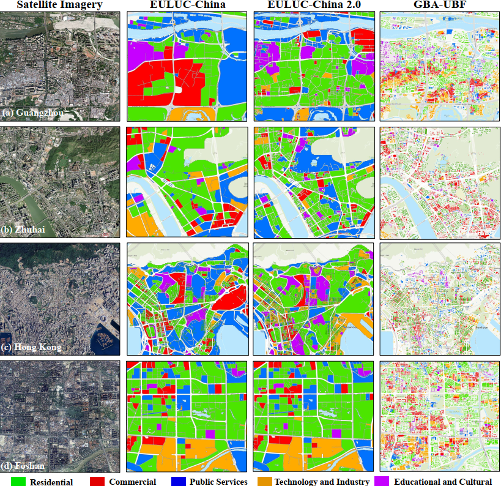

# GBA-UBF
This is the Dataset of the **Greater Bay Area Urban Building Function** (**GBA-UBF**) proposed by our paper "A Large-Scale and Fine-Grained Building Function Classification Dataset in the Greater Bay Area".

**GBA-UBF** a building-level function dataset for **the Guangdong–Hong Kong–Macao Greater Bay Area**. GBA-UBF provides **city-wide**, **building-scale** labels that overcome the coarse granularity of parcel maps. It covers 4 million buildings across six core GBA cities (**Guangzhou**, **Shenzhen**, **Zhongshan**, **Zhuhai**, **Foshan**, **HongKong SAR**) with five unified classes: **Residential**, **Commercial**, **Public Services**, **Technology and Industry**, **Educational and Cultural**.

## GBA-UBF Preview
<p align="center">
  <br>
  <em>Figure 1. A preview of the GBA-UBF dataset.</em>
</p>

<p align="center">
  <br>
  <em>Figure 2. Representative GBA-UBF Dataset 3D Visualization and Corresponding Shapefile Overlay with High-Resolution Remote Sensing Imagery across six cities.</em>
</p>

<p align="center">
  <br>
  <em>Figure 3. The Comparison between the GBA-UBF Dataset and EULUC-China Dataset.</em>
</p>

## Dataset Download
Please enjoy this dataset we have provided. Click [here](demo/) to view one examples of the study aera in Guangzhou.

## Dataset structure
````
dataset
|--GBA-UBF
|  |--Guangzhou_1
|  |  |--<imageGZ>.<ImageFormat>
|  |  |--<DSM_GZ>.<TIF>
|  |  |--Residential_shp
|  |  |--Commercial_shp
|  |  |--PublicServices_shp
|  |  |--TechnologyIndustry_shp
|  |  |--EducationalCultural_shp
|  |--Shenzhen_1
|  |  |--<imageSZ>.<ImageFormat>
|  |  |--<DSM_SZ>.<TIF>
|  |  |--Residential_shp
|  |  |--Commercial_shp
|  |  |--PublicServices_shp
|  |  |--TechnologyIndustry_shp
|  |  |--EducationalCultural_shp
...
````
Each shapefile also contains building height information.


## Dataset construct and LAGraph-PolyCMX method
Please locate the code for generating true value data for urban building functional class in [folder construct_GT/](pipeline/construct_GBA-UBF/construct_GT/) and generating DSM data in [folder generateDSM/](pipeline/construct_GBA-UBF/generateDSM/). The code for the LAGraph framework can be found in [folder LAGraph/](pipeline/LAGraph/). For PolyCMX code, please refer to the Pix2Poly and CMX code sections. The code for the GIS analysis can be found in [folder GIS_ana](pipeline/GIS_ana/). The other code in [folder pipeline/](pipeline/) is used for Data preprocessing.

## Organizations
<p align="center">
  
  
</p>
